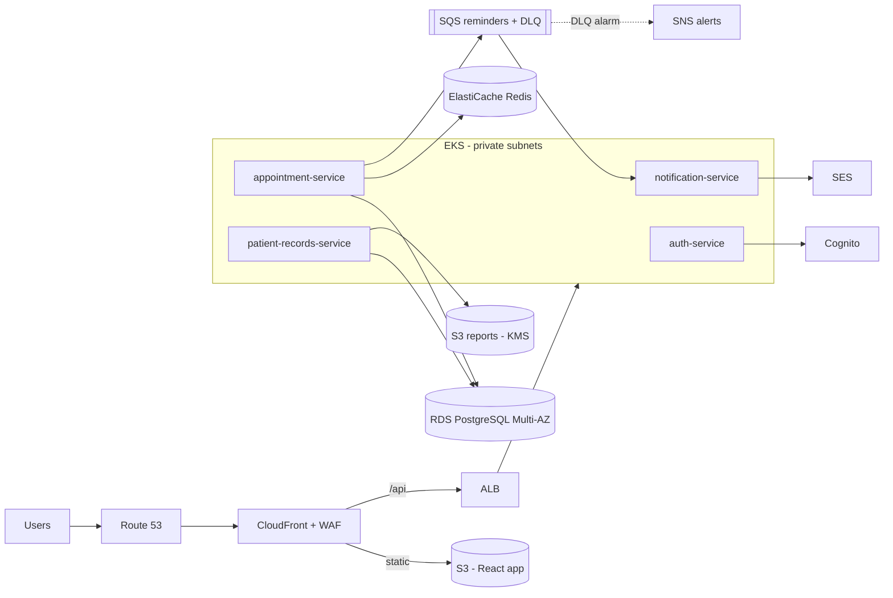

# Architecture

## Request flow
1. User signs in with Cognito (SRP, optional TOTP MFA) and receives a JWT.
2. Services verify the JWT against the Cognito JWKS and enforce `patient` / `doctor` roles.
3. Booking writes to Postgres (unique constraint prevents double-booking), invalidates the Redis slot cache, and queues a reminder on SQS.
4. notification-service consumes the queue and sends mail through SES. Poison messages go to the DLQ after 5 tries and trigger an SNS alert.
5. Report uploads use short-lived presigned S3 URLs. Objects are KMS-encrypted; every access is written to the audit log.
